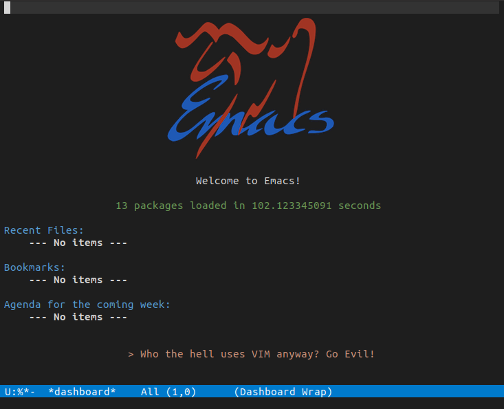

# My Emacs Initialization for Deep Learning

This repo includes the Emacs initialization file which I have used for several years for python coding of deep learning.

## Usage
First install emacs to your machine, then copy the `.emacs` file to your home directory `~/`.

