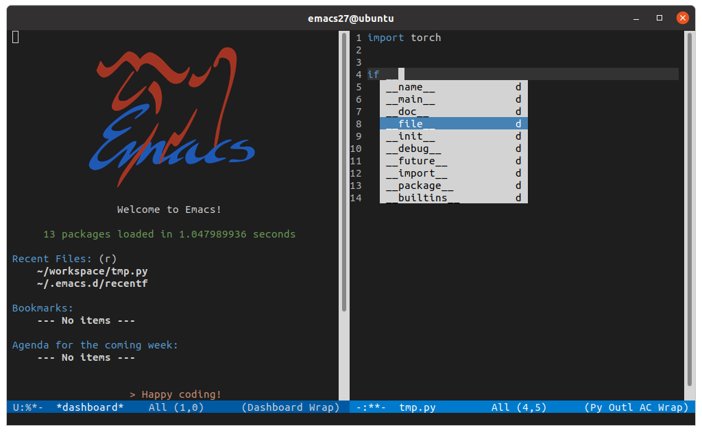

# Emacs Initialization for Deep Learning

This repo includes the Emacs initialization file which I have used for several years for python coding of deep learning. My configuration contains editor features such as [auto-completion](https://github.com/auto-complete/auto-complete), [vscode-like theme](https://github.com/ianyepan/vscode-dark-plus-emacs-theme), python coding supports, and the [tree-like file manager](https://github.com/jaypei/emacs-neotree).




## Usage
First install emacs to your machine, then copy the `.emacs` file to your home directory `~/`.

To install the newest emacs (emacs27), use the following command:

```bash
sudo add-apt-repository ppa:kelleyk/emacs
sudo apt update
sudo apt install emacs27
```

If you do not have the root privilege, check the solution [here](https://gist.github.com/tnarihi/6054dfa7b4ad2564819b).

The default melpa source is set to `http://melpa.org/packages/`. If the connection is not stable, try `http://mirrors.tuna.tsinghua.edu.cn/elpa/melpa/` instead. More details are [here](https://mirrors.tuna.tsinghua.edu.cn/help/elpa/)
